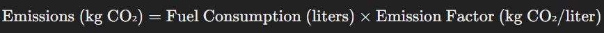

# Dynamic Route Optimizatoin & Emissions Reduction system
A Python & React based System with a Beautiful Design that Ranks Routes based on User Priority taking into account various factors like Real-Time Traffic, Emissions, Weather Conditions, Travel Time & Travel Distance 

## Ranking Routes
### Step 1: Determining Factors
The Ranking Process starts right with Determining the Factors for Route Ranking Condiseration.
For this system, the following Factors were taken into Consideration while Ranking Routes:-

- Time to Reach the Destination
- Distance of the Route
- Traffic Delays
- Emissions for each route
- Weather Conditions

Once the Factors are finalized, determining Priority for each Factor is the next step.
For this System, the Priorities were set in the following manner(Higher to Lower):-

1. Travel Time
2. Travel Distance
3. Traffic Delay
4. Emissions
5. Weather Conditions
 
Provisions have been made in both the Frontend & Backend to Dynamically set Priorties by setting the Efficiency dropdown in the Frontend. The user can select between priortizing for Time, Distance or Emissions.
Each selection dynamically reshuffles the Priority in the backend.

### Step 2: Fetching Data
This involves getting User Input from the Frontend for:-
- Vehicle Class
- Source Location
- Destination
- Route Priority (Efficiency in Frontend)
- Cargo Weight

Apart from the User Input, the Following API calls are made:-

| API Service | Purpose                                                             |
|-------------|---------------------------------------------------------------------|
| TomTom      | Fetching Route Points, Travel Time, Travel Distance & Traffic Delay |
| Open Meteo  | Fetching Weather Data                                               |
 

The TomTom API is used to fetch 3 routes per Source & Desination for Ranking & giving user options to choose routes from.
 

### Step 3: Scoring Weather Data
Weather Conditions along the route like the Temperature, Precipitation & Wind Speed are fetched via the API Call to factor in when ranking routes.
These individual Weather Factors need to be scored individually first.
This is simply achieved in the backend by Checking if the returned Weather Factor values are within a specific range & assigning a score to it.
For E.g.: If the Temperature along the route from Mumbai to Delhi is in between 15-26 degrees, it will be assigned a score of 5, a score of 4 if it is in between 27-31 degrees, so on & so forth. \

Similarly, the other Weather Factors are also scored. \

Finally, the Weather Score is computed by Summing the Product of Individual Weather Factor Scores with the Individual Weather Factor Weights
 

This weather score is later factored in when computing the Final Route Score.
 

### Step 4: Calculating Fuel Consumption, Cargo Weight Adjusted Fuel Consumption & Emissions
It is important to calculate Fuel Consumption as it helps us determine the Emissions along the route.
- Fuel Consumption is calculated using the Following Formula:-
 

 

The Fuel Efficiency is already predefined based on the Vehicle Class set by the user in the Frontend.
 

This Fuel Consumption is then Adjusted to the Cargo Weight(set by the user via Frontend) for accurate Emissions Calculation.
 
- Adjusted Fuel Consumption (AE) is given by the Formula:-

 

Where,
- BE: Baseline fuel efficiency (vehicle without cargo) in km/l
- k: Fuel efficiency penalty factor (drop in km/l per unit weight of cargo)
- W: Weight of the cargo in kilograms.

 
k is assumed to be 0.002 km/l, per kg of Cargo Weight

 
Next, we calculate the Emissions....
 
- Emissions are given by the Formula:-
 

 

### Step 5: Scoring & Ranking Routes
Routes are Scored by following these steps:-

1. Normalization\
The Scoring Process begins by Normalizing the Values of the Factors(Travel Time, Travel Distance, .....) set for each route.\
Normalization is achieved by using Min-Max scaling.

2. Weights Normalization\
Weights are normalized by Dividing a particular weight for a factor by the sum of all weights \
Better understood by the following Formulas:-
 

 

 

3. Finally the Score for each Route is computed by the following Formula:-
 

 

The Routes are then ranked based on their Scores(Lower is Better)
 
## Displaying Routes
The Final Ranked Routes list of Dictionary containing the Factor Value, Route Points, Score and Rank is passed back to the Frontend for plotting & constructing a polyline along passed route points

## Future Scope
Going Beyond the Scope,:-
- We trained a simple Model to predict Estimated Time of Arrival (ETA) based on the Time of Departure. \
The model is included in this repository and can be found using the name, 'FedEx Mpdel.py' \
We plan on implementing this on a wider scale by Simulating Real-Time change in Location & then using this data to dynamically update routes, predict Real-Time Weather Impact & Traffic Conditions. \
- Building a Carbon Footprint Dashboard giving detailed insights about Emissions per Route

## Demo Video

